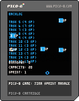

# SCRUMASTER!: The Jira Sprint Manager

SCRUMASTER! is a fun and educational game designed to simulate managing a sprint in Jira. The objective is to manage your sprint backlog, catch tasks, avoid bugs, and complete sprints successfully.

## Game Overview

In this game, you take on the role of a Scrum Master managing a sprint. You need to:

- Catch tasks in your bucket to add them to your burndown.
- Avoid bugs, which will increase your workload.
- Manage unplanned work that appears randomly.
- Complete sprints without exceeding capacity.
- Carry over incomplete tasks to the next sprint.

## How to Play

- Use the arrow keys to move the bucket left and right.
- Catch falling tasks to complete them.
- Avoid bugs or manage the increased workload if caught.
- Complete sprints and manage your capacity effectively.

## Game Features

- **Dynamic Backlog:** Tasks and unplanned work are generated dynamically for each sprint.
- **Bug Management:** Some tasks contain bugs that double the workload.
- **Unplanned Work:** Random unplanned work with low story points but high actual effort.
- **Sprint Management:** Carry over incomplete tasks to the next sprint.

## Controls

- **Left Arrow Key:** Move the bucket left.
- **Right Arrow Key:** Move the bucket right.

## Installation and Running the Game

Do the usual Pico-8 things or run the native application from the Release.
