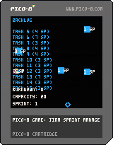

# SCRUMASTER!: The Jira Sprint Manager

SCRUMASTER! is now a minimal Kanban board built with PICO-8.
Manage tasks across **Backlog**, **Doing**, and **Done** columns
and keep your sprint flowing.



## Game Overview

Select tasks and move them between columns to reflect their
progress.  The board starts with a handful of autogenerated tasks
in the backlog.

## How to Play

- Use **left/right** arrows to change columns.
- Use **up/down** arrows to choose a task within the column.
- Press **X** to move the selected task forward.
- Press **O** to move the task backward.

## Controls

| Key | Action |
| --- | ------ |
| Left / Right | Switch columns |
| Up / Down | Select task |
| X (button 5) | Move task to the next column |
| O (button 4) | Move task to the previous column |

## Running the Game

The cart runs on both **PICO-8** and **Picotron** in PICO-8
compatibility mode.

```bash
pico8 -x scrumaster.p8
picotron -x scrumaster.p8    # requires Picotron with the PICO-8 emulator
```

Alternatively, load `scrumaster.p8` from the Picotron desktop and
run it from there.

